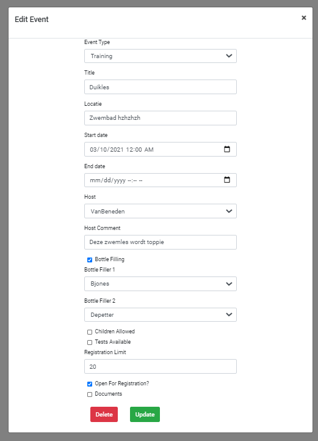

# Logboek

## Week 1

### 08/03/2021

Introductie bij Realdolmen. Het was fijn om kennis te maken met de andere studenten. Spijtig genoeg ga ik ze waarschijnlijk nooit meer in het echt zien. Na een algemene presentatie bespreken we samen met onze stagebegeleider onze opdracht. Spijtig genoeg zit die van mij thuis met ziekte. Ik krijg de info van iemand anders

### 09/03/2021

Blijkbaar is de info die ik heb gekregen gisteren fout. Ik maak kennis met een medestudent, Steven. Samen met hem ga ik de komende maanden aan het project werken. 

We moeten een website maken voor een duikclub, gebruik makende van micro frontends.

Het duurde bijna de hele dag voordat ik de bestaande code zelf kon draaien op de laptop die ik heb gekregen.

### 10/03/2021

Ik schrijf samen met Steven de user-stories voor het project. We fixen de scructuur van het project. We zijn nu bezig aan een kalender waarop je evenementen kan toevoegen voor de duikclub.

### 11/03/2021

Ik heb de hele dag zitten prutsen op te proberen een scherm te maken waarop je een evenement kan bijwerken.

### 12/03/2021

Een heleboel bugs uit ons programma gehaald. Fields gemaakt om errors op te vangen. Je kan nu ook een evenement toevoegen aan de kalender.

Zo ziet hij er momenteel uit:

| De Kalender                                                  | Een evenement bewerken                                       |
| ------------------------------------------------------------ | ------------------------------------------------------------ |
|  |  |

