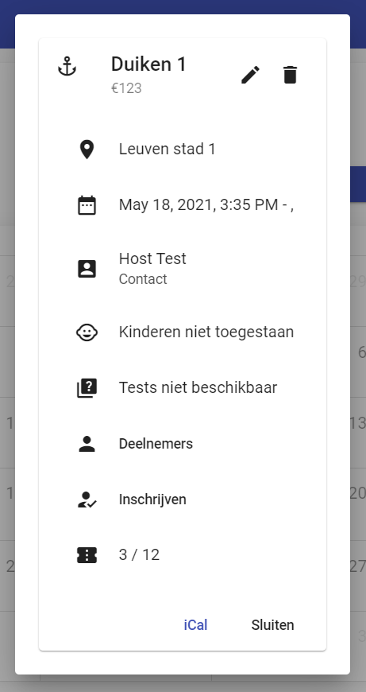
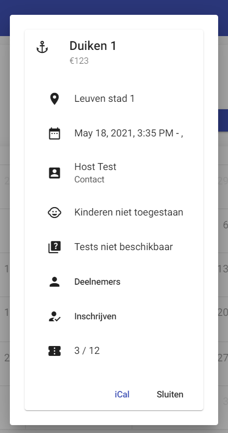
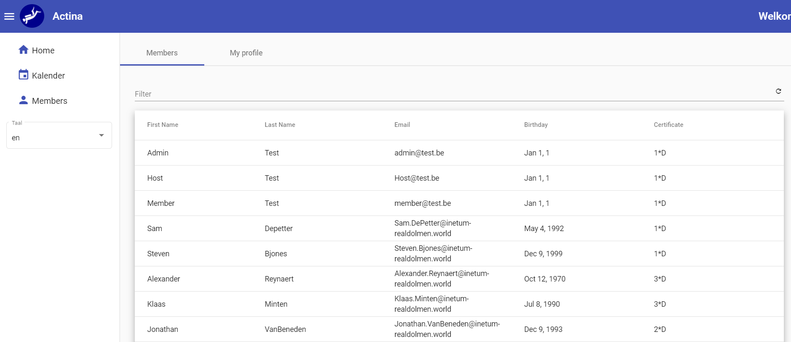

# Logboek
[terug](https://martijnmeeldijk.github.io/stage/)


## Week 10

### 10/05/2021

 Het leek mij leuk om vandaag eens te proberen met behulp van de adviezen van mijn mentoren en bug op te lossen. Dit bleek uiteindelijk niet zo gemakkelijk.

De bug zit in het gedeelte van de code waar de evenementen uit de API worden opgehaald. Ze worden namelijk niet direct ingeladen als de app start, maar pas als er een interactie met de gebruiker gebeurt.

Eén van mijn mentoren had een tijd geleden een stukje code geschreven dat dit zou kunnen oplossen.

```typescript
getAllEvents(): Observable<CalendarEvent[]> {
    return this.http.get<IEvent[]>(baseUrl, { responseType: 'json' }).pipe(map(res => res.map(event => ({
      id: event.id.toString(),
      title: event.title,
      start: new Date(event.startDate),
      end: new Date(event.endDate),
      cssClass: event.eventIcon
    }))));
  }
```

Op een oude versie van onze app zou dit gewerkt hebben, spijtig genoeg nu niet meer. Dit komt doordat het icoontje van het evenement nu niet meer wordt bijgehouden in het evenement, maar in het evenementtype. 

Ik had dat dan zo opgelost:

```typescript
calendarEvents : CalendarEvent[] = []
  
  getAllEvents(): CalendarEvent[] {
  this.http.get<IEvent[]>(baseUrl, { responseType: 'json' }).subscribe( res => {
    res.forEach(element => {
      this.eventTypeService.get(element.eventTypeId).subscribe (eventType => 
       this.calendarEvents.push({
         id : element.id.toString(),
         title : element.title,
         start : new Date(element.startDate),
         end : new Date(element.endDate),
         cssClass : eventType.icon,
       }) )
    });
  })
    return this.calendarEvents
}
```

Maar dan zitten we weer met onze bug. Goed, ik ga aan iets anders werken en misschien komt het antwoord later ineens via een soort briljante inval tot mij.


### 11/05/2021

Dat van gisteren laat ik nu even ter zijde. Ik werk verder aan het *members* gedeelte van de applicatie. Ik moet er nog voor zorgen dat leden hun eigen profiel kunnen bekijken en bewerken. 


### 12/05/2021

Oké, dat van gisteren is nog niet volledig af. We kregen zonet te horen dat onze mentors graag een echte **demo** willen op maandag. We moeten er dus snel voor zorgen dat de applicatie een beetje toonbaar is. 

Ik ga dus heel de app door en zoek naar dingen die mogelijk fout zijn.

Het duurt niet lang en ik vind al iets. Als je inlogt als member, kan je nog steeds evenementen aanmaken. Dat kan niet de bedoeling zijn...

Het komt dus door deze lijn code 

```html
<button *ngIf="authService.getRole() != 'user'" (click)="newEvent()" mat-menu-item>
```

Het woordje `user` zou daar `member` moeten zijn. Ik was ook vergeten dat members evenementen ook niet mogen aanpassen of verwijderen, dus heb ik die knopjes ook verborgen. (zie foto hieronder)

| Admins en hosts                                              | Members                                                      |
| ------------------------------------------------------------ | ------------------------------------------------------------ |
|  |  |


Donderdag en vrijdag heb ik vrij


### 15/05/2021

Ik weet dat het zaterdag is en ik eigenlijk niet moet werken, maar ik wou toch nog wat prutsen aan de app zodat ik op de demo iets heb om te laten zien. 

Ik werk verder aan het members gedeelte, zodat het toonbaar is voor de demo. Je kan nu ook op *my profile* klikken om je eigen profiel te tonen. (je zou ook je profiel moeten kunnen bewerken, maar zo ver ben ik nog niet geraakt)



