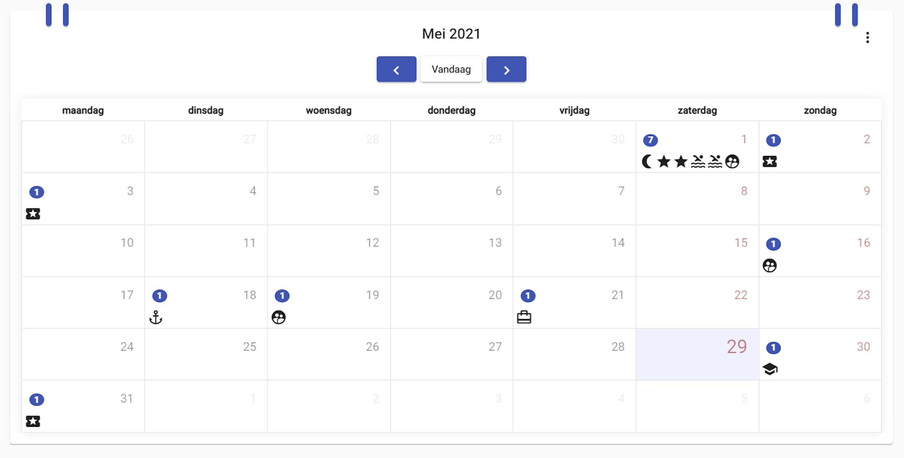

# Logboek
[terug](https://martijnmeeldijk.github.io/stage/)


## Week 12

### 25/05/2021

Vandaag mijn eerste dag alleen...

Na mijn meeting met Alexander ga ik direct aan de slag. Ik wil eerst en vooral ervoor zorgen dat alle teksten in de verschillende talen op onze website kloppen. 

Gemakkelijker gezegd dan gedaan. De code die zorgt voor de vertalingen werkt niet.

Na lang zoeken bleek het dus dat de code die checkt of de gebruiker een taal heeft gekozen niet werkt. Ik schrijf een domme fix.

```typescript
if(localStorage.getItem("language") != 'en' && localStorage.getItem("language") != 'fr'){
      localStorage.setItem("language", 'nl');
 }
```

Alvorens je klaagt: `localStorage.getItem("language") != null` werkte niet. Dit wel.


Nu ik klaar ben met dit gedeelte update ik mijn scripts om de *translation keys* uit alle delen van de app te halen. Ik vervang stukken tekst door keys waar nodig. Dan run ik mijn scripts opnieuw en **BAM**... Ik kan de vertalingen invullen in de gegenereerde JSON files.


### 26/05/2021

Ik ga verder met wat bugs op te lossen

Om de één of andere reden konden leden van de duikclub andere leden uitschrijven uit evenementen. Niet de bedoeling... Er werden ook in het inschrijvingsformulier soms velden getoond die er niet moesten staan. Dit was relatief makkelijk opgelost met een paar `*ngIf`'s. Er waren ook nog sommige dingen zichtbaar die voor normale gebruikers niet zichtbaar mochten zijn. 


Verder heb ik ook de code wat opgeruimd. Er zaten nog een heleboel nutteloze `console.log` statements en commentaren tussen.


### 27/05/2021

De `MatSnackBar` (een plugin die we gebruiken om snackbars te tonen). Toonde niet altijd alle errors. Die heb ik opgelost door een paar lijnen code toe te voegen in onze error interceptor. Als er zich een vreemde fout voordoet, komt er nu: *"something went wrong"* te staan.

Voor de rest zijn er nog een aantal UI bugs die ik moet oplossen. Om de één of andere reden staat er een scrollbar op het navigatiemenu. Dit kwam doordat de lijst-elementen een klein ietsiepietsie beetje te groot waren. 

Ik heb ook nog wat css mediaqueries toegevoegd. Zo worden nu bepaalde dingen verborgen op kleine schermen om de bruikbaarheid op mobiele telefoons te verbeteren.


### 28/05/2021

Ik werk nog wat verder om het design van de kalender helemaal af te krijgen. Ik had een leuk idee om hem er wat beter uit te laten zien.



Er zijn nu zo van die kleine ringetjes (zoals bij een echte kalender)!! Yeey!! 

Er waren ook wat dingen die gisteren om de één of andere reden kapot waren (ik denk dat het Alexander zijn schuld was hihihihihi). Het members gedeelte wilde niet werken. Er was een error die zei dat die URL van het request misvormd was. Er ontbrak zo te zien een `/`. Nou ja wat doe je eraan? Er een `/` bijzetten natuurlijk. BAM! Toen werkte het weer. Magie... 

