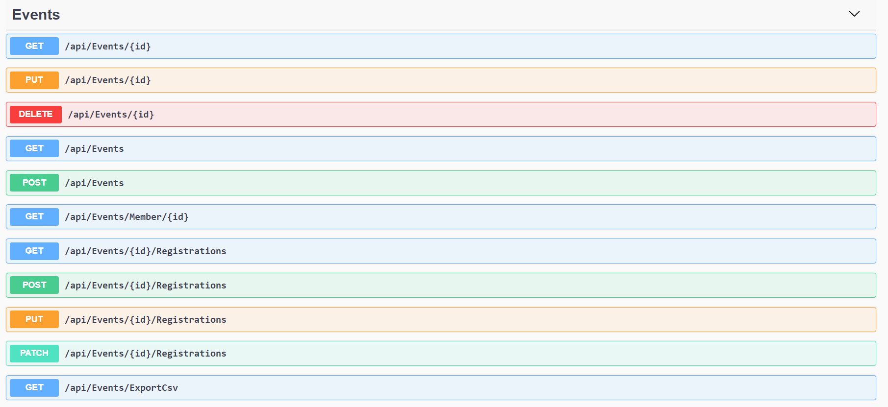
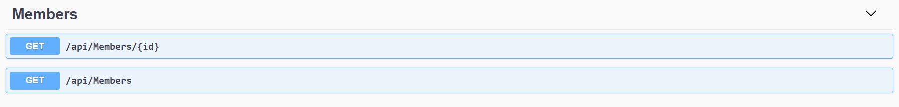
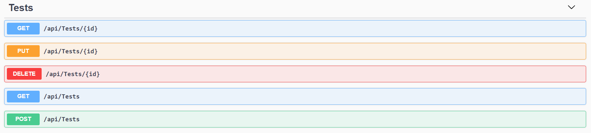

# Logboek

## Week 2

### 15/03/2021

Vandaag heb ik gewerkt aan de front-end van de EventTypes. Oké dat zegt misschien niet veel. Ik zal even kort de structuur van de applicatie uitleggen.

Steven heeft in de voorbije maand een API gemaakt in ASP.NET. Zo kan onze front-end gemakkelijk de nodige data opvragen.

> **Evenementen**:  Een lid van de club kan zich inschrijven op een evenement. Deze evenementen zouden moeten worden getoond op de persoonlijke kalender van elk lid.

> **Evenementtypes**: Elk evenement heeft een evenementtype bv. een feest of een vergadering. Een evenementtype beschijft welke velden er verplicht zijn in een evenement.

> **Leden**: een lid van de club. Bevat zijn/haar naam, geboortedatum, etc.

> **Toetsen**: Een lid kan zich inschrijven voor een toets om een bepaald certificaat te behalen.

Nu je al deze nuttige kennis hebt opgedaan, kan ik verdergaan met mijn uitleg. Vandaag heb ik dus een onderdeel geschreven in Angular om ervoor te zorgen dat je door middel van een visuele gebruikersinterface een nieuw evenementtype kan aanmaken. Zo ziet het er op dit moment uit:

### 16/03/2021

Vanochtend heb ik met Steven gebeld om de code die we de voorbije dagen hebben geschreven, samen te voegen (mergen). Met de onvermijdelijke problemen die daar natuurlijk aan te pas komen. De rest van de dag heb ik verder gewerkt aan mijn evenementtypes (er was echt nog veel werk aan). Verder heb ik ook Steven geholpen met een probleem dat hij had. Hij wou een component* maken om een lijst van gebruikers te tonen. Je zou dan uit deze lijst een gebruiker kunnen kiezen om zo van deze gebruiker zijn persoonlijke kalender te tonen. 

Dit zou later moeten aangepast worden naar een login systeem. We weten nog niet welke methode we van onze opdrachtgever moeten gebruiken hiervoor, dus voor nu doen we het met een selectiemenu, zodat we al in ieder geval met de kalender en de evenementen verder kunnen.

> Components are the main building block for Angular applications. Each component consists of:
>
> - An HTML template that declares what renders on the page
> - A Typescript class that defines behavior
> - A CSS selector that defines how the component is used in a template
> - Optionally, CSS styles applied to the template

### 17/03/2021