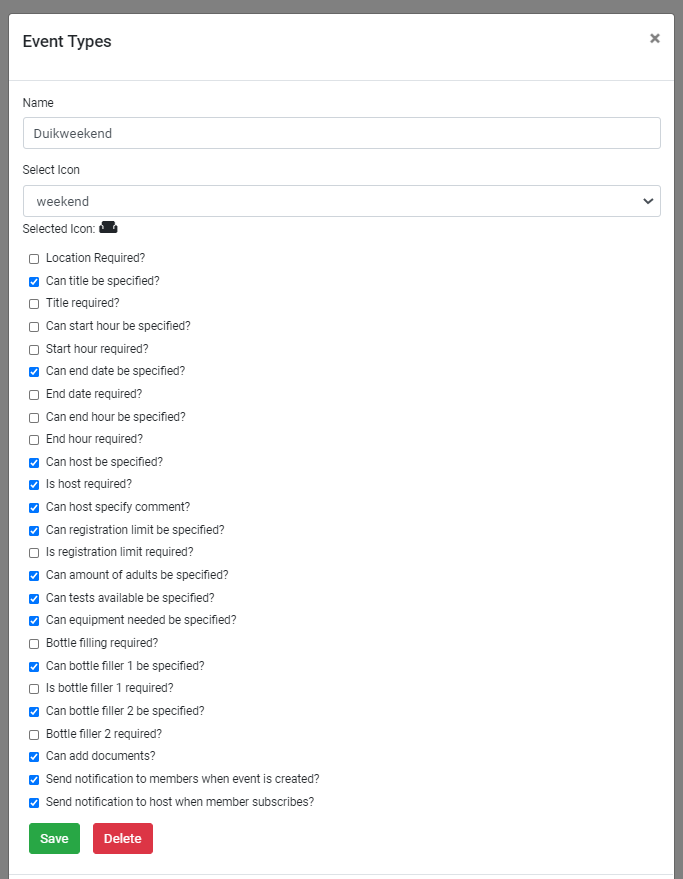

# Logboek
[terug](https://martijnmeeldijk.github.io/stage/)

## Week 2

### 15/03/2021

Vandaag heb ik gewerkt aan de front-end van de EventTypes. Oké dat zegt misschien niet veel. Ik zal even kort de structuur van de applicatie uitleggen.


Steven heeft in de voorbije maand een API gemaakt in ASP.NET. Zo kan onze front-end gemakkelijk de nodige data opvragen.


> **Evenementen**:  Een lid van de club kan zich inschrijven op een evenement. Deze evenementen zouden moeten worden getoond op de persoonlijke kalender van elk lid.


> **Evenementtypes**: Elk evenement heeft een evenementtype bv. een feest of een vergadering. Een evenementtype beschijft welke velden er verplicht zijn in een evenement.


> **Leden**: een lid van de club. Bevat zijn/haar naam, geboortedatum, etc.


> **Toetsen**: Een lid kan zich inschrijven voor een toets om een bepaald certificaat te behalen.


Nu je al deze nuttige kennis hebt opgedaan, kan ik verdergaan met mijn uitleg. Vandaag heb ik dus een onderdeel geschreven in Angular om ervoor te zorgen dat je door middel van een visuele gebruikersinterface een nieuw evenementtype kan aanmaken. Zo ziet het er op dit moment uit:


### 16/03/2021

Vanochtend heb ik met Steven gebeld om de code die we de voorbije dagen hebben geschreven, samen te voegen (mergen). Met de onvermijdelijke problemen die daar natuurlijk aan te pas komen. De rest van de dag heb ik verder gewerkt aan mijn evenementtypes (er was echt nog veel werk aan). Verder heb ik ook Steven geholpen met een probleem dat hij had. Hij wou een component* maken om een lijst van gebruikers te tonen. Je zou dan uit deze lijst een gebruiker kunnen kiezen om zo van deze gebruiker zijn persoonlijke kalender te tonen. 

Dit zou later moeten aangepast worden naar een login systeem. We weten nog niet welke methode we van onze opdrachtgever moeten gebruiken hiervoor, dus voor nu doen we het met een selectiemenu, zodat we al in ieder geval met de kalender en de evenementen verder kunnen.


> Components are the main building block for Angular applications. Each component consists of:
>
> - An HTML template that declares what renders on the page
> - A Typescript class that defines behavior
> - A CSS selector that defines how the component is used in a template
> - Optionally, CSS styles applied to the template


<<<<<<< HEAD


### 17/03/2021


Hier zie je de component die de code voor mijn lijst van de evenementtypes bevat.

**event-type-list-component.css**

```css
.fas{
    padding: 3px;
}

.day-collapsable {
    color: #111;
    background-color: #EEE !important;
    box-shadow: inset 0 0 6px 0 rgb(0 0 0 / 20%);
}

.day-collapsable > div {
    margin: 1em;
}

.material-icons{
    vertical-align: bottom;
}

```

Deze file bevat de code om de component te 'stylen'. De code die hier staat wordt toegevoegd bovenop de stijlen die we doorheen de hele applicatie gebruiken. (bootstrap)


**event-type-list-component.html**

```html
<div class="m-3" [ngSwitch]="action">
  <actina-calendar-event-type-form *ngSwitchCase="'create'" [eventType]="activeEventType"
    (saveEvent)="createEventType()" (deleteEvent)="closePopup()"></actina-calendar-event-type-form>
  <actina-calendar-event-type-form *ngSwitchCase="'edit'" [eventType]="activeEventType" (saveEvent)="updateEventType()"
    (deleteEvent)="deleteEventType()"></actina-calendar-event-type-form>
  <div *ngSwitchDefault>

    <td><button class="btn btn-primary" (click)="create()"><i class="fas fa-fw fa-plus"></i></button></td>

  </div>

</div>

<table class="table">
  <thead>
    <tr>
      <th scope="col">Event Type</th>
      <th scope="col">Edit</th>
      <th scope="col">Delete</th>
    </tr>
  </thead>
  <tbody>
    <tr *ngFor="let eventType of eventTypes">
      <th scope="row">{{eventType.name}}</th>
      <td><button class="btn btn-primary" (click)="edit(eventType)"><i class="fas fa-fw fa-pencil-alt"></i></button>
      </td>
      <td><button class="btn btn-primary" (click)="delete(eventType)"><i class="fas fa-fw fa-trash-alt"></i></button>
      </td>
    </tr>
  </tbody>
</table>
```

Dit onderdeel bevat de angular-html van de component. Je kan er bovenop gewone html allemaal coole functies van angular in gebruiken. In dit onderdeel gebruiken we bv. `ngFor`.  Hiermee loopen we over de lijst van evenementtypes om deze dynamisch te weergeven in de pagina. In een component kan je ook een andere component oproepen. Hier gebruik ik zo `actina-calendar-event-type-form` dit is een andere component, gelijkaardig aan de deze, die het formulier bevat om een nieuw evenementtype aan te maken. Door middel van `ngSwitch` kan ik wisselen tussen `edit` en `create`.  Deze twee functies roepen allebei hetzelfde formulier op, maar met andere inhoud. Zo wordt er bij `edit` alle data van het bestaande evenementtype ingeladen. 

Op deze manier kan je dus met angular herbruikbare stukken code schrijven.


**event-type-list.component.spec.ts** 

Dit bestand bevat de tests voor de component.

```typescript
import { ComponentFixture, TestBed } from '@angular/core/testing';

import { EventTypeListComponent } from './event-type-list.component';

describe('EventTypeListComponent', () => {
  let component: EventTypeListComponent;
  let fixture: ComponentFixture<EventTypeListComponent>;

  beforeEach(async () => {
    await TestBed.configureTestingModule({
      declarations: [ EventTypeListComponent ]
    })
    .compileComponents();
  });

  beforeEach(() => {
    fixture = TestBed.createComponent(EventTypeListComponent);
    component = fixture.componentInstance;
    fixture.detectChanges();
  });

  it('should create', () => {
    expect(component).toBeTruthy();
  });
});
```

Nu staat er eigenlijk nog niets in. Ik zal misschien eens aan mijn collega's moeten vragen hoe je eigenlijk een test schrijft in angular. Ik wil graag bijleren!


**event-type-list.component.ts**

Deze file bevat de logica achter de html file die wordt getoond in de browser. 

```typescript
export class EventTypeListComponent implements OnInit {

  public eventTypes: IEventType[]
  public activeEventType: IEventType;
  public action = '';


  constructor(private crudService: CrudService,
    public activeModal: NgbActiveModal) { }

  ngOnInit(): void {
    this.getEventTypes();
  }
    
    //...
    
    edit(eventType: IEventType) {
       	this.activeEventType = eventType;
        this.action = 'edit';

  }
    
    updateEventType(): void {
        this.crudService.update('${url}/EventTypes/${this.activeEventType.id}', this.activeEventType)
            .subscribe(
            response => {
                this.action = '';
                this.getEventTypes();
            },
            error => {
                console.log(error);
            });
  }
    //...
    
}
```

Ik heb een deel van de code weggelaten omdat het anders hier een beetje te lang wordt. 

`ngOnInit` zorgt ervoor dat wanneer de component ingeladen wordt, de functie `getEventTypes()` wordt opgeroepen. Deze functie zorgt ervoor dat alle bestaande evenementtypes worden ingeladen. Als je dan bij een evenementtype op `edit` klikt, wordt de `edit()` functie uitgevoerd, deze functie laat weten aan de klasse dat via de `ngSwitch` in de html (van hiervoor). Het formulier om het evenementtype te bewerken moet worden geopend. Wanneer je in het formulier dan op `save` klikt, wordt de functie `updateEventType()` uitgevoerd. Dit zorgt ervoor dat de wijzigingen die het hebt aangebracht worden doorgevoerd naar de backend. 

Als we al deze code laten samenwerken krijgen we dit:

 

=======
### 17/03/2021
>>>>>>> 53abd5ae9a303eac7f799a9144b2db29ed5c82a4
