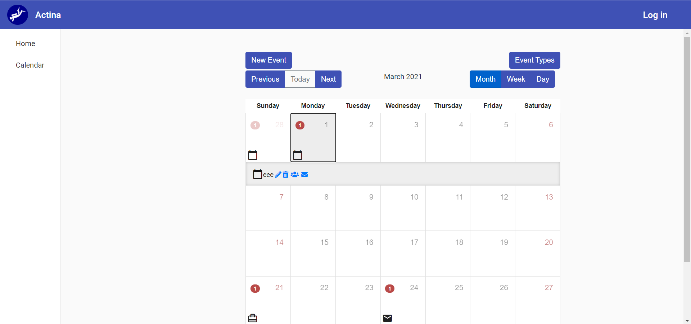
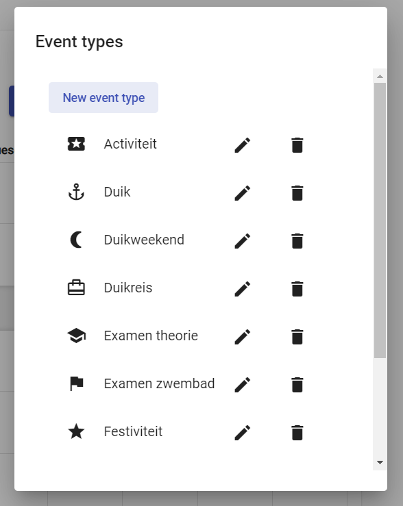
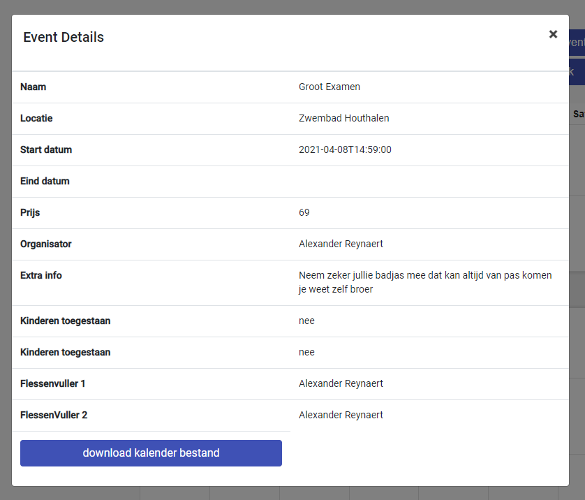

# Logboek
[terug](https://martijnmeeldijk.github.io/stage/)


## Week 4

### 29/03/2021

Vandaag heb ik veel gewerkt aan de styling van de applicatie. Ik heb een navigatiebalk gemaakt met het logo van het bedrijf. Ik heb ook samen met steven wat bug uit de applicatie gehaald. 

Een nieuwe feature! De snackbar! (nee niet zo een snackbar)

> A **Snackbar** is a message used to give users feedback after taking an action. They are ephemeral and time out after a few seconds. Use **Snackbars** when you need a quick, lightweight way of providing feedback following an action they've taken.

Een snackbar is dus eigenlijk een soort van pop-up notificatie. 

Ik heb lang zitten prutsen omdat mijn snackbar altijd achter onze pop-up vensters terecht kwam. De oplossing was om de z-index van onze pop-ups te veranderen zodat ze niet voor de snackbar terecht kwamen.

```scss
.modal{
  margin-top: 64px;
  z-index: 999 !important;
}
.modal-backdrop{
  z-index: 998 !important;
}
```


### 30/03/2021

Oké dus de bedoeling is om wanneer een error zich voordoet, deze te tonen in de snackbar. Nu dus in alle formulieren gaan instellen dat de snackbar moet getoond worden bij een fout (en ook als het formulier geslaagd is).


Ik heb nu ook een sidebar toegevoegd en de bestaande code wat opgeschoond.



Het begint er als een echte applicatie uit te zien.


Nu doe ik als laatste vandaag nog wat styling voor het scherm waar je de inschrijvingen voor een evenement kan zien.


### 31/03/2021

Ik heb iets leuks gevonden. Je kan in Angular een klasse maken waarmee je alle HTTP errors in de app mee kunt opvangen. Op deze manier moeten we ons binnen de componenten geen zorgen maken om errors. 


Ik heb een klasse `HTTPErrorInterceptor` gemaakt die dit doet.

```typescript
import { HttpEvent, HttpInterceptor, HttpHandler, HttpRequest, HttpErrorResponse } from '@angular/common/http';
import { Injectable } from '@angular/core';
import { MatSnackBar } from '@angular/material/snack-bar';
import { Observable, throwError } from 'rxjs';
import { catchError } from 'rxjs/operators';

@Injectable()
export class HttpErrorInterceptor implements HttpInterceptor {

  constructor(private snackbar: MatSnackBar){}

  intercept(request: HttpRequest<any>, next: HttpHandler): Observable<HttpEvent<any>> {
    return next.handle(request)
      .pipe(
        catchError((error: HttpErrorResponse) => {
          let errorMsg = '';
          if (error.error instanceof ErrorEvent) {
            console.log('this is client side error');
            errorMsg = `Error: ${error.error.message}`;
          }
          else if(typeof error.error.error != undefined){
            console.log('this is server side error');
            errorMsg = `Error: ${error.status},  Message: ${error.error.error}`;
          }
          else {
            console.log('this is server side error');
            errorMsg = `Error: ${error.status},  Message: ${error.message}`;
          }
          console.log(error)
          this.snackbar.open(errorMsg, 'close', { duration: 2000, panelClass: 'snack-bar' });
          return throwError(errorMsg);
        })
      )
  }
}
```

Nu moet ik ook niet in elke component apart de snackbar oproepen. Handig toch!


### 01/04/2021

Yeey! Alexander is terug!

We hebben een demo gegeven om te laten zien waar we nu zitten met het project en we hebben wat feedback gekregen. 

Mijn taak is nu om de UI mooi te krijgen. (spoiler; ik doe dit heel graag). Ik mag me nu lekker de komende dagen bezig houden met het herdesignen van alles wat we tot nu toe hebben gemaakt.

Ik begin met de kalender zelf:


Nu ziet hij er een beetje minder uit als iets dat in 2010 ontworpen is.


Nu ga ik verder met het designen van de dialoogvensters. Hiervoor heb ik nog wat onderliggende aanpassingen moeten doen. Ik gebruik nu de dialoogvensters van angular-material in plaats van die van bootstrap.



Ik ben echt trots, het begint er allemaal wel wat cleaner uit te zien. Verder doe ik nog wat aanpassingen aan de `EditEventComponent` en `NewEventComponent`


### 02/04/2021

Vandaag kan ik lekker verder werken aan de UI. Ik ga triestig zijn als het gedaan is. Dit is zo leuk. 

Ik ga verder met het design van de `EventDetailComponent`. Zo ziet het er na wat werk uit:


We komen van dit:



Om eerlijk te zijn laat de nieuwe versie toch vermoedelijk wel een betere indruk achter bij toekomstige gebruikers.

Ik ga maar weer eens verder werken. 