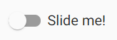
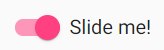

# Logboek
[terug](https://martijnmeeldijk.github.io/stage/)


## Week 9

### 03/05/2021

Ik zoek samen met Steven naar een probleem (ik ga heel eerlijk zijn, ik ben vergeten wat het was). 

Oké, ik begin met een nieuwe feature. Ik wil als de gebruiker van de app ingelogd is, hij op een knop kan drukken die ervoor zorgt dat alleen de evenementen worden getoond waarop hij is ingeschreven.

Ik wil dat het er een beetje cool uitziet, dus ik gebruik de `<mat-slide-toggle>` van Angular Material.

|  |  |
| ------------------------------------------------------------ | ------------------------------------------------------------ |
| Filter uit                                                   | Filter aan                                                   |

Nu zorg ik ervoor dat mijn knop elke keer dat hij van staat verandert een functie oproept.

```typescript
filterToggleClicked(){
    if(this.filterChecked){
      const testUser = 'e05ce6aa-e09a-4bc2-75b2-08d90e3f9ac2' // Sam Depetter, tijdelijk omdat 
      // de authservice geen user geeft die overeenkomt met eentje in de database
      let list
      this.eventRegistrationService.getAllEventsFromMember(testUser).subscribe(
        success => {
          list = success.map(x => x.eventId);
          this.allEvents = this.events;
          this.events = this.events.filter(  x => list.indexOf(x.id) > -1);
        }
      )
    }
    else {
      this.events = this.allEvents
    }
    
```

Ik doe dit nu dus tijdelijk met een hardcoded id. In de toekomst zouden we dan de id van de gebruiker uit het log-in systeem kunnen halen. 


### 04/05/2021

Er was nog een bug met dat van gisteren. Elke keer dat ik op het knopje klikte, werden de evenementen dubbel weergegeven, zo bleven ze opstapelen (als je 10 keer op de knop klikte waren er 10 evenementen i.p.v. één).

In het stuk code van gisteren heb ik het nu aangepast. Ik gebruik een tijdelijke variabele `allEvents` waarin ik de huidige staat van de lijst met evenementen in bewaar, alvorens ze te filteren. Als je de filter terug uitzet, dan worden de evenementen in `allEvents` terug in de lijst `events` gestoken.


### 05/05/2021

Oké, we hebben net een meeting gehad. 

In ons systeem hebben we drie rollen: `User`, `Host` en `Admin`. Ieder van deze rollen heeft toegang tot verschillende onderdelen van de applicatie. Zo hebben we bijvoorbeeld een knop, *Edit event*. Het is niet de bedoeling dat een `User` de datum van een evenement kan veranderen. Dit wordt afgetoetst in de backend, maar in de frontend zou de knop om een evenement te bewerken dus ook verborgen moeten worden.

We hebben een service `auth.service.ts` genaamd, die al het gedrag rond autorisatie en authenticatie encapsuleert in één klasse. Ik voeg twee nieuwe functies toe aan deze klasse 

```typescript
saveRole(): void {
    this.getUserClaims().subscribe(
        response => {
            let role = response.claims.find(x => x.type == "extension_Role");
            localStorage.setItem("role", role.value);
        }
    )
}

getRole(): string {
    return localStorage.getItem("role");
}
```

`saveRole()` zorgt ervoor dat de rol van de gebruiker wordt opgeslagen in `LocalStorage`, zodat we niet elke keer aan de backend moeten vragen welke rol onze user nu precies heeft. `getRole()` geeft ons dan de voormalig opgeslagen rol.


Nu kunnen we in onze `HTML`-code ervoor zorgen dat `users` de knop voor nieuwe evenementen niet te zien krijgen (ze kunnen er toch niks mee doen)

```html
 <div class="col-md-4" *ngIf="authService.getRole() != 'user'">
      <button mat-raised-button (click)="newEvent()">New Event</button>
 </div>
```


### 06/05/2021

